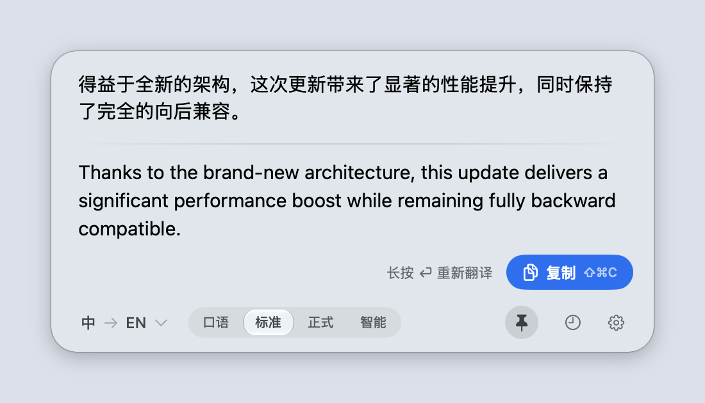
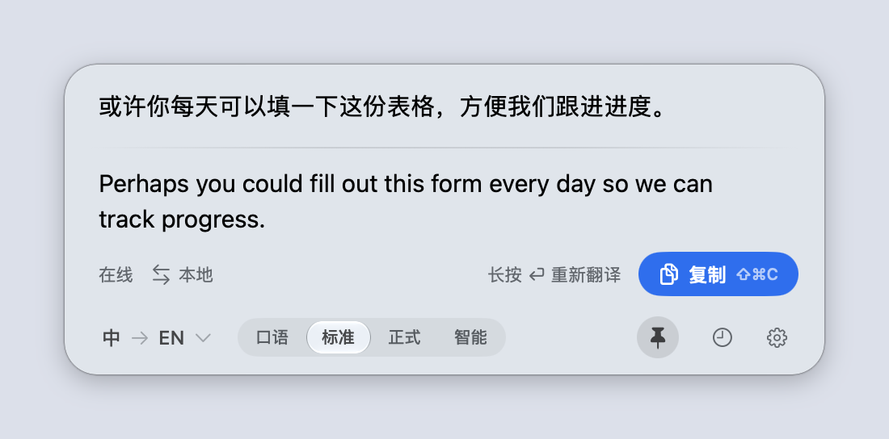
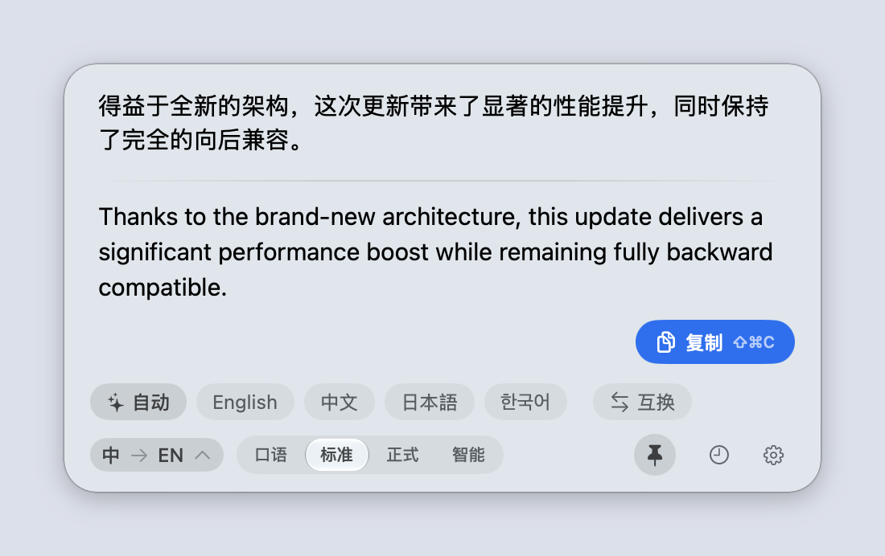
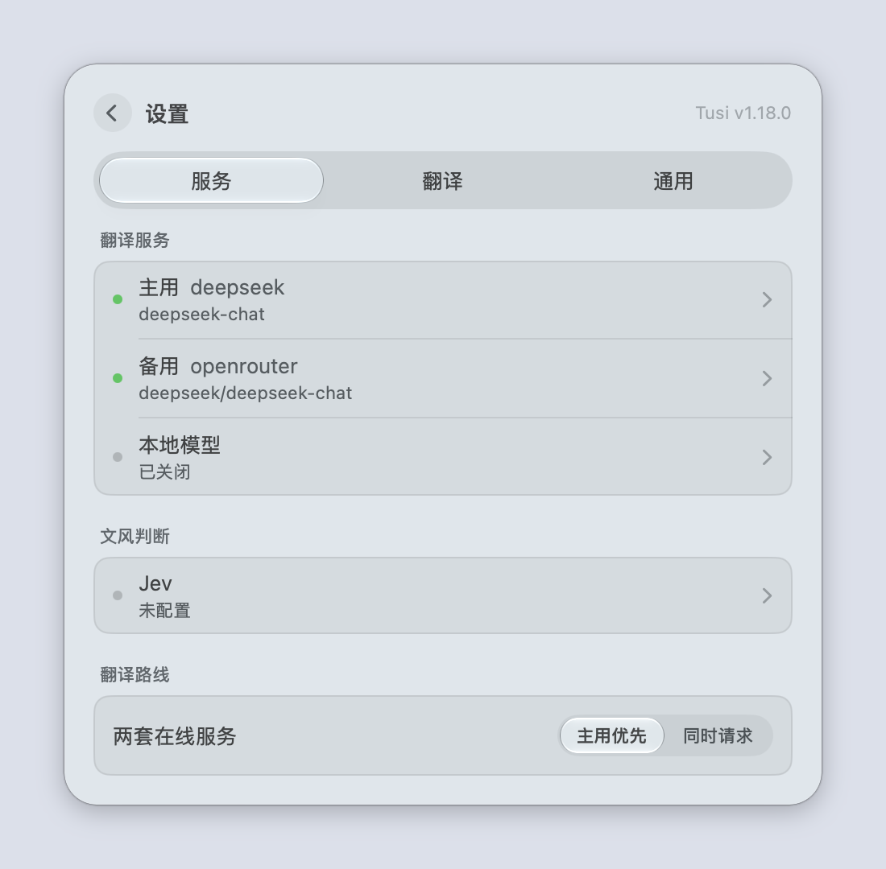

# Tusi

[English](README.md) · **简体中文**

一款 macOS 菜单栏翻译工具。输入中文得到英文，输入其他语言得到中文。Tusi 会自动判断翻译方向，
需要时也可以手动指定目标语言。

<p align="center">
  <picture>
    <source media="(prefers-color-scheme: dark)" srcset="docs/screenshots/translate-dark.png">
    
  </picture>
</p>

## 功能

- 在本机自动判断翻译方向，中英混排的文本也能处理
- 需要时可指定目标语言：英语、中文、日语、韩语
- 菜单栏面板，用 ⌥Space 呼出
- 自带 API Key 接入任意 OpenAI 兼容服务（DeepSeek、OpenRouter、硅基流动等），
  也可以使用不需要 Key 的本地服务
- 三个服务位：主用、备用两套在线服务，外加一个本地模型
- 先用本地模型翻译，再按一次 ⏎ 请在线服务给出第二个版本——两个结果都会保留，
  剪贴板跟随你正在查看的那一个
- 翻译完成后长按回车 1.5 秒可重新翻译；设置 → 翻译里有开关，可以同时关闭这个手势和它的进度提示
- 两套在线服务可以「主用优先」，也可以「同时请求」
- 口语、标准、正式三种文风，另有可选的「智能」文风交给 Jev 判断；智能文风会在结果旁显示它选了哪种，
  判断不出来时使用标准
- 每次请求都会带上的「附加要求」——一条术语约定、一种行文风格、一个不要翻译的名字
- 可选：自动复制结果、完成提示音；本地保存最近 50 条翻译历史
- 输出使用弯引号，代码片段和代码块保持原样
- 能对付「号称 OpenAI 兼容其实不完全兼容」的接口：优先使用结构化输出，服务器第一次不支持时
  自动察觉，并以纯文本重试这次请求
- 可选：登录时启动、自动检查更新
- 除了打开设置的 ⌘, 以外，所有快捷键都可以重新绑定
- 译文一次性完整出现——没有逐字闪烁，本地和远程模型表现一致。自动适配浅色/深色模式；
  macOS 26 及以上使用 Liquid Glass

| 先本地、再请在线给第二个版本 | 指定目标语言 | 服务一览 |
|---|---|---|
|  |  |  |

## 系统要求

- macOS 14 及以上
- 任意 OpenAI 兼容服务的 API Key——或者只用本地模型（Ollama、LM Studio、llama.cpp-server），
  无需 Key
- 使用 Jev 驱动的智能文风需要 Jev API Key；没有的话，智能文风会使用标准

## 安装

从 [Releases](../../releases) 下载：

- `Tusi-arm64.zip` — Apple 芯片
- `Tusi-universal.zip` — Apple 芯片 + Intel

解压后把 `Tusi.app` 移到「应用程序」。App 没有经过公证，首次打开时如果被 Gatekeeper 拦下，
右键点击 App 选择「打开」即可。

## 配置

打开设置（⌘,）→ 服务。页面列出了所有服务——主用、备用、本地模型和 Jev——以及各自的服务商、
模型或状态；点击任意一项进入它自己的页面。在线服务需要填写：

- 接口地址，例如 `https://api.deepseek.com` 或 `https://openrouter.ai/api/v1`
- 模型，例如 `deepseek-flash`
- API Key
- 供应商优先顺序（可选，在高级选项里）——即 OpenRouter 的 `provider.order`，例如 `novita`。
  这只是偏好，不是限制：OpenRouter 仍可能回退到你没有列出的供应商。

本地模型位有一个启用开关。它可以发现 GGUF 文件，并通过已有的
`~/Library/LaunchAgents/com.tusi.llamaserver.plist` 服务（监听 `127.0.0.1:8080`）切换模型。
关闭托管模型会把它从内存中卸载，但不会删除模型文件或当前选择。关闭状态下选择其他模型只会保存选择，
不会启动服务；开启状态下切换模型会先卸载之前的进程。运行时和模型文件需要事先装好。
其他本地服务可以在高级选项里手动配置。

设置 → 服务 → 翻译路线决定三个服务位（主用、备用、本地）如何使用：

- **从哪开始**——本地模型，或在线服务。从本地开始并不等于只用本地：本地结果先出来，
  再按一次 ⏎ 就会请在线服务给出它的版本。两个结果都会保留，结果下方的小标签可以在两者之间切换。
- **两套在线服务**——主用优先（只有主用失败时才换备用），或同时请求（两边同时发出，
  先返回可用结果的胜出）。后一种模式下两边都可能计费。只有两个服务位都是远程服务时才提供这个选项：
  本机回环地址的服务光靠网络延迟就会稳赢。

只有真正需要选择时，对应的问题才会出现。配置了备用服务后，主用请求如果在产生任何输出之前失败，
可以自动转到备用。API Key 保存在 macOS 钥匙串里，而不是偏好设置里；每个服务都有「测试连接」。

Jev 的页面有单独的 API Key 和测试连接按钮。选择智能文风后，每次开始翻译时会把原文发给 Jev 一次，
然后这次请求（包括重试和更高一级的结果）都使用它选定的口语、标准或正式文风。如果没有 Key、Jev 不可用，
或者判断不明确，翻译会继续使用标准文风。Jev 的连接测试发送的是一句固定的示例句子，不会发送你的草稿。
翻译服务的连接测试使用与真实翻译相同的协议协商，最多发送两个短请求。开启自动检查更新后，
启动时和之后每六小时检查一次。

翻译历史会同时保留本地和在线两个版本，包括回答它的主机和模型。每个存档的文本字段最多保留
4,000 个字符、32 KB；被截断的版本会有标记。右键点击一条记录可以删除。清空历史会回到翻译页，
并在底栏上方显示一行「撤销」。这个撤销会一直保留，直到开始新的翻译、打开设置，或者再次打开并关闭历史。
删除单条记录时历史保持打开，「撤销」显示在「清空历史」旁边，直到离开历史页。
翻译历史和输入草稿的保存可以在设置里分别关闭。历史还可以在 24 小时、7 天或 30 天后自动删除（默认关闭），自动过期的记录不可撤销。关闭保存会删除对应的已保存数据；清除输入草稿不会删除历史。
文本以仅所有者可读写的文件权限保存在本机，没有加密。

另有两个按需使用的选项：

- **附加要求**（设置 → 翻译）——附加到每一次翻译请求里的一条要求，不论由哪个服务回答。
  可以用来写术语约定、行文风格，或必须保留原样的名字。为空时默认折叠。
- **输出协议**（每个服务的高级选项）——「自动（推荐）」会请求结构化输出，服务器不支持时改用纯文本重试。
  如果某个接口声称支持结构化输出、实际上却不遵守，请选择「纯文本兼容」。改变的只是请求格式，
  译文本身不变。

如果新装的版本又要求你重新授权 API Key，运行一次 `./build.sh keychain-unpin`。macOS 用一个
partition 列表保护钥匙串条目：由带 Team ID 的身份签名的 App，条目是 `teamid:`；否则是 `cdhash:`
——而 cdhash 每次构建都会变，所以不管签名多稳定，自签名的 App 每次都会被当成新应用。因此本地构建会优先使用
`Apple Development:` 身份（如果有的话），上面的命令会把已有条目改指向那个 Team ID。
发布包仍然使用匿名的自签名身份，因为 Development 证书里带有开发者的姓名和邮箱。

开机后 macOS 完成首次解锁之前，钥匙串还不能访问。如果作为登录项在这之前启动，可能会暂时读不到
API Key；系统解锁后 Tusi 会自动恢复。

## 快捷键

| 操作 | 按键 |
|---|---|
| 显示 / 隐藏面板 | ⌥Space |
| 翻译 | ⏎ |
| 在线重译（本地结果出来之后） | 再按一次 ⏎ |
| 换行 | ⇧⏎ 或 ⌘⏎ |
| 复制结果 | ⇧⌘C |
| 历史 | ⌘Y |
| 设置 | ⌘, |
| 返回 / 关闭 | Esc |

显示/隐藏、翻译、换行、复制、历史、返回/关闭都可以在设置 → 快捷键里重新绑定。
请在线服务给出第二个版本沿用「翻译」键；打开设置的 ⌘, 是固定的。

## 构建

需要 Xcode 26.6 或更新版本来编译 macOS 26 的 API 和 isolated deinit。
构建出的 App 仍然支持 macOS 14 及以上；SDK 要求和运行时要求是两回事。

```bash
./build.sh                        # 为当前架构构建 build/Tusi.app
TUSI_ARCH=universal ./build.sh    # 通用二进制（arm64 + Intel）
./build.sh install                # 构建并安装到 /Applications（调试循环）
./build.sh install --open         # 构建、安装并启动
./build.sh release                # 在 dist/ 生成 arm64 和 universal 两个发布 zip
```

`scripts/readme-screenshots.sh` 会用 `TUSI_PREVIEW` 示例场景重新生成 `docs/screenshots` 里的图片；
请在 `./build.sh` 之后运行。

默认的版本号和构建号来自 `VERSION`；CI 或发布脚本可以用 `TUSI_VERSION` 和 `TUSI_BUILD_NUMBER` 覆盖。

纯 Swift + SwiftUI + AppKit，没有第三方依赖。`build.sh` 会优先使用本机的代码签名身份
（这样重新构建后钥匙串访问权限还在），没有的话退回 ad-hoc 签名。公开分发请使用 Developer ID
身份并对 App 进行公证。

开发签名身份（`Tusi Dev Signing`）放在登录钥匙串里，macOS 登录时会自动解锁它。`build.sh`
签名后会校验签名。如果你的机器把签名身份放在单独的钥匙串里，可以用旧的覆盖方式：

```bash
TUSI_SIGN_KEYCHAIN=~/Library/Keychains/tusi-dev.keychain-db \
TUSI_SIGN_KEYCHAIN_PW_FILE=~/.dsh/tusi-signing.pw ./build.sh
```

本地安装优先使用稳定的 Team ID 身份。只保持同一张自签名证书，并不能保证二进制变化后钥匙串授权仍然有效；
原因见上面关于 partition ID 的说明。公开发布包使用单独的分发身份。

### 诊断面板高度

面板高度不是一次测量出来的——结果文本决定结果视口的尺寸，视口决定内容的尺寸，内容再决定窗口的尺寸——
而每一环都是一个 preference 写进 `@State`，再决定下一环的 frame。SwiftUI 并不保证会为自己的 state
写入所引起的布局重新发送 preference，所以某一环可能会「沉默」，一旦如此，窗口就会停留在上一条结果的尺寸。

因此面板会自我检查。每次尺寸调整稳定后，它会直接问 AppKit 内容实际有多大——这个问题不会被缺失的
preference 干扰——如果窗口太小就把它撑大，并写出最近 48 次测量。这在所有构建里都会运行，面板正常时什么都不输出，
所以第一步是去找记录，而不是打开什么开关：

```bash
/usr/bin/log show --predicate 'subsystem == "com.tusi.app"' --last 1h --style compact | grep height
```

出现 `height mismatch:` 行、后面跟着 `height chain:` 行，就是面板抓到了自己的问题：链条按顺序排列，
停止汇报的那一环就是出问题的那一环。什么都没有，说明面板和内容每次都对得上。

手动复现问题时，如果想看每一环的实时输出：

```bash
defaults write com.tusi.app heightDiagnostics -bool true   # 然后重启 Tusi
defaults delete com.tusi.app heightDiagnostics             # 再关掉
```

请使用完整路径 `/usr/bin/log`：很多人的 shell 里都定义了一个叫 `log` 的函数，它会悄悄吞掉参数。

## 许可证

MIT
